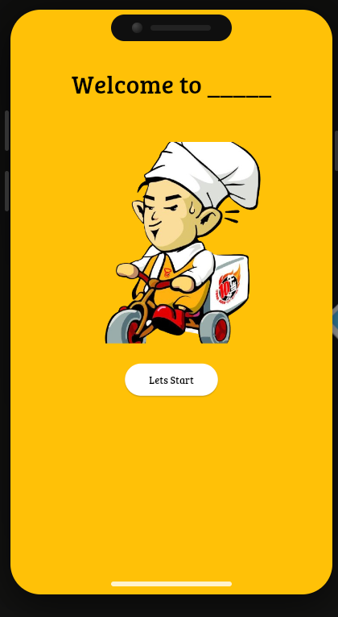
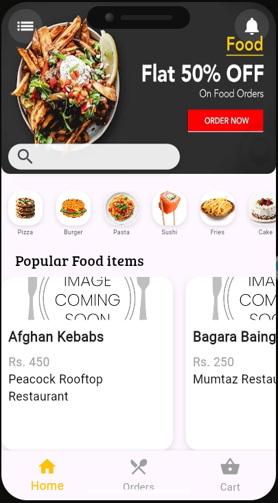
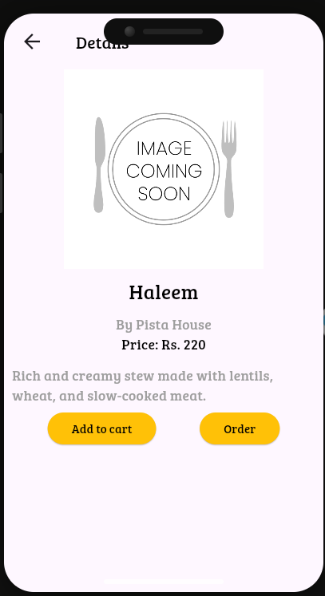
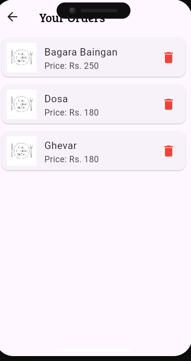
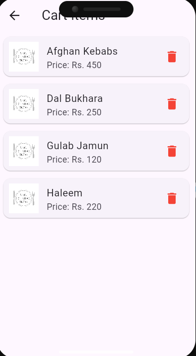

<h2>📱 App Workflow</h2>

<h3>1️⃣ Start Page</h3>
<ul>
  <li>App opens with the <b>Start Page</b>.</li>
  <li>By clicking the <b>"Let's Start"</b> button, user navigates to the Home Page.</li>
</ul>

<h3>2️⃣ Home Page</h3>
<ul>
  <li>Displays a list of food items.</li>
  <li>When the user clicks a food item (in the row), they enter the <b>Description Page</b>.</li>
</ul>

<h3>3️⃣ Description Page</h3>
<ul>
  <li>Shows detailed information about the selected food.</li>
  <li>By clicking the <b>"Order"</b> button (ElevatedButton), the item gets added to the <b>Order Page</b>.</li>
  <li>Similarly, items can be added to the <b>Cart Page</b>.</li>
</ul>

<h3>4️⃣ Order Page</h3>
<ul>
  <li>Contains all items the user has ordered.</li>
</ul>

<h3>5️⃣ Cart Page</h3>
<ul>
  <li>Contains all items added to the cart.</li>
  <li>Can be accessed directly from the <b>bottom navigation bar</b>.</li>
</ul>

<h3>🔄 Navigation Flow</h3>
<ul>
  <li>Default page = <b>Home Page</b>.</li>
  <li>Bottom Navigation Bar is used to switch between <b>Home, Orders, and Cart</b> pages.</li>
</ul>

<h3>Use of placeholder</h3>

Placeholder is used when the imagUrl caused Client Exception 

